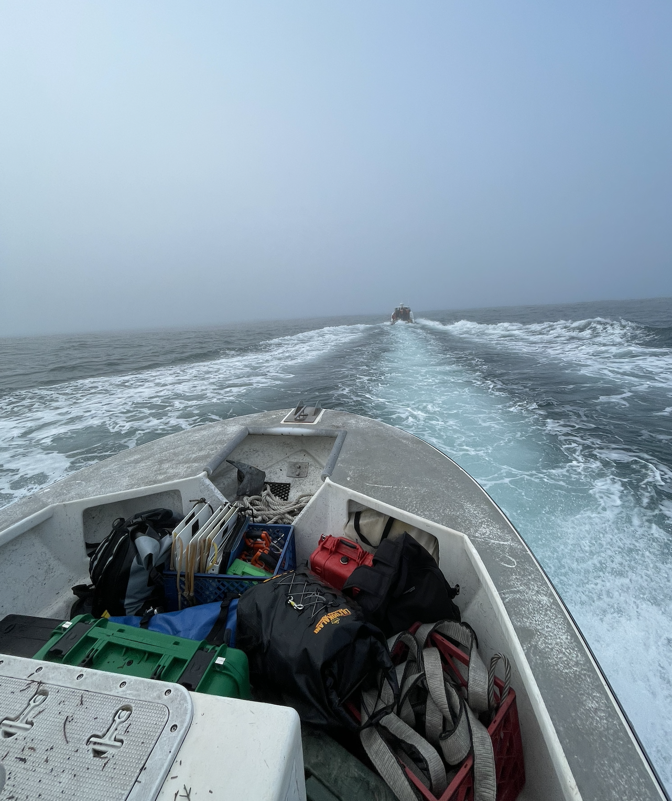
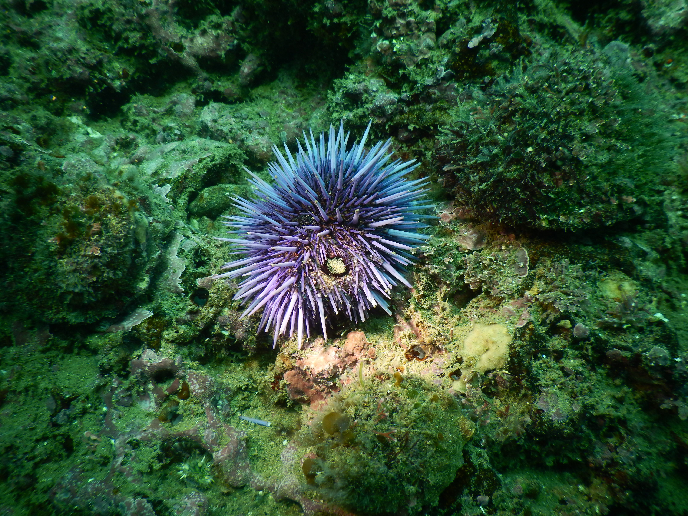
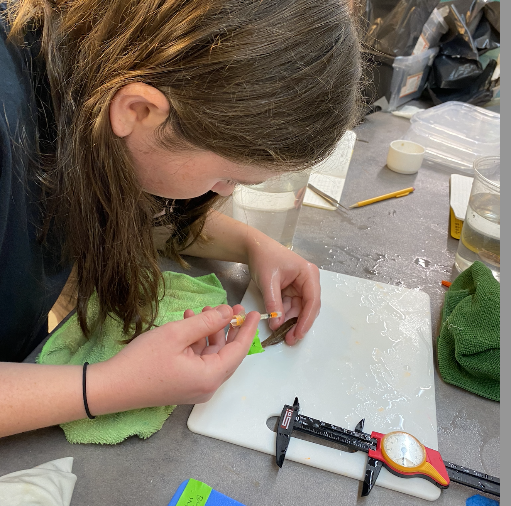
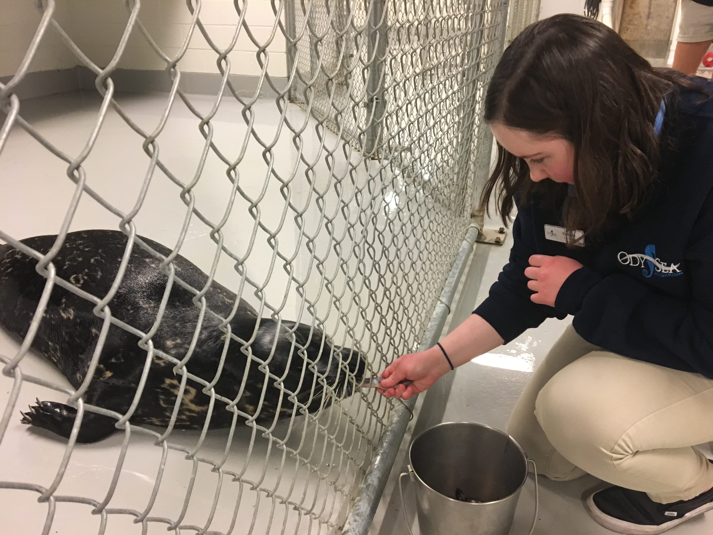

## **Field Research Experience**

-   [Beltran Lab](https://beltranlab.ucsc.edu) \| 2021 - Present

{width="300"}

-   Raimondi-Carr Lab, [PISCO](https://piscoweb.org) \| 2023

{width="300"}

-   [Kroeker](http://kristy-kroeker.squarespace.com/people) and [Kilpatrick](https://kilpatrick.eeb.ucsc.edu/sample-page/) Labs \| 2023, 2024

{width="300"}

-   US Geological Survey (USGS) \| 2023

{width="300"}

-   BIOE 159 (Marine Ecology Field Quarter) \| 2022
-   BIOE 128L (Large Marine Field Vertebrates Field Class) \| 2022
-   BIOE 161L (Kelp Forest Ecology Field Course) \| 2021

## **Science Communication**

To improve accessibility and engagement with the Beltran Lab's ongoing research I create plain language summaries of research articles for Año Nuevo docents. So far I have covered these papers:

1.  Beltran, Lozano, Morris, Robinson, Holser, Keates, Favilla, Kilpatrick, Costa. (2024). Individual variation in life-history timing: synchronous presence, asynchronous events and phenological compensation in a wild mammal. *Proceedings of the Royal Society B* [10.1098/rspb.2023.2335](10.1098/rspb.2023.2335)

2.  Payne, Czapanskiy, Kilpatrick, Robinson, Munro, Ong, Bastidas, Negrete, Theders, Stillwell, Coffey, Schweitzer, Baugh, Salazar, Chau-Pech, Rodrigues, Chavez, Wright, Rivas, Reiter, Costa, Beltran. (2024). Reproductive success and offspring survival decline for female elephant seals past prime age. *The Journal of Animal Ecology*. [10.1111/1365-2656.14226](10.1111/1365-2656.14226)

3.  Condit, Reiter, Morris, Oliver, Robinson, Costa, Beltran, Le Boeuf. (2024). Inherent versus random variation in fitness of elephant seals: offspring quality and quantity. *Canadian Journal of Zoology*. [10.1139/cjz-2023-0166](10.1139/cjz-2023-0166)

## **Wet Lab Experience**

-   Beltran Lab \| 2022 - Present
-   BIOE 159 (Marine Ecology Field Quarter) \| 2022

{fig-align="left" width="300"}

## **Programming/Software Experience**

-   R \| 2022 - Present
-   GitHub \| 2024 - Present

## **Volunteer Experience**

-   OdySea Aquarium \| 2017 - 2018

{width="300"}

## **Club And Community Involvement**

-   Rachel Carson College Council
-   Women in Science Society
-   Student Union Assembly
-   Student Organization Funding Advisory Committee
