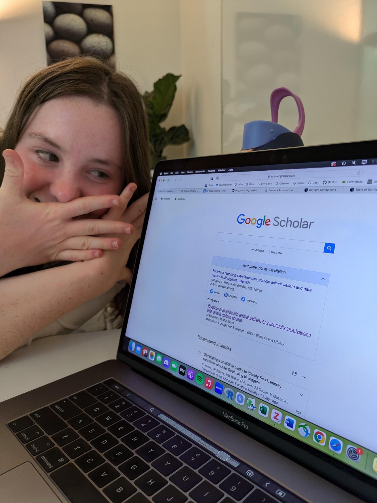

{width="7.5cm"}

## Publications

1.  **Hale**, Jouma’a, Brown, Robinson, Holser, Costa, Beltran. Spatiotemporal variation in marine mammal anti-predator behaviors resulting from a predation pinch point. (2026). *Ecology and Evolution*. DOI: [10.1002/ece.372841](10.1002/ece.372841)
2.  Payne, **Hale**, Davidson, Kendall-Bar, Beltran. Towards a minimum reporting standard to promote animal welfare and data quality in biologging research. (2026). *Animal Biotelemetry*. DOI: [10.1186/s40317-025-00438-w](10.1186/s40317-025-00438-w)
3.  Beltran, Payne, Kilpatrick, Hale, Reed, Hazen, Bograd, Jouma’a, Robinson, Houle, Matern, Sabah, Lewis, Sebandal, Coughlin, Valdes Heredia, Penny, Dalrymple, Penny, Sherrier, Peterson, Reiter, Le Boeuf, Costa. Elephant seals as ecosystem sentinels for the northeast Pacific Ocean twilight zone. (2025). *Science*. DOI: [10.1126/science.adp2244](10.1126/science.adp2244)
4.  Beltran, Kilpatrick, Picardi, Abrahms, Barrile, Oestreich, Smith, Czapanskiy, Favilla, Reisinger, Kendall-Bar, Payne, Savoca, Palance, Andrezjaczek, Shen, Adachi, Costa, Storm, **Hale**, Robinson. (2024). Biologging for the future: how biologgers can help solve fundamental questions, from individuals to ecosystems. *Trends in Ecology and Evolution*. DOI: [10.1016/j.tree.2024.09.009](10.1016/j.tree.2024.09.009)
5.  Czapanskiy\^, Arcila-Hernández\^ (\^contributed equally), Munro, Garfield, Bastidas, Payne, Ong, Storm, Adachi, **Hale**, Brown, Robinson, Stewart, Abdel-Raheem, Zavaleta, Beltran. Long-term studies can and should provide structure for inclusive education and professional development. (2024). *Ecology Letters* (Special Issue on Very Long-Term Studies). DOI: [10.1111/ele.14482](10.1111/ele.14482)

## Media Features

[UCSC Newsletter](https://news.ucsc.edu/2024/10/biologging-research-framework/)

-   I got to talk about how working on [a highly collaborative research paper](10.1016/j.tree.2024.09.009) helped me develop critical research skills.

[Mongabay](https://news.mongabay.com/2025/03/seal-oceanographers-reveal-fish-abundance-in-pacific-oceans-twilight-zone/)

-   I got to talk about the findings and impacts of our [2025 *Science* paper](10.1126/science.adp2244)!
